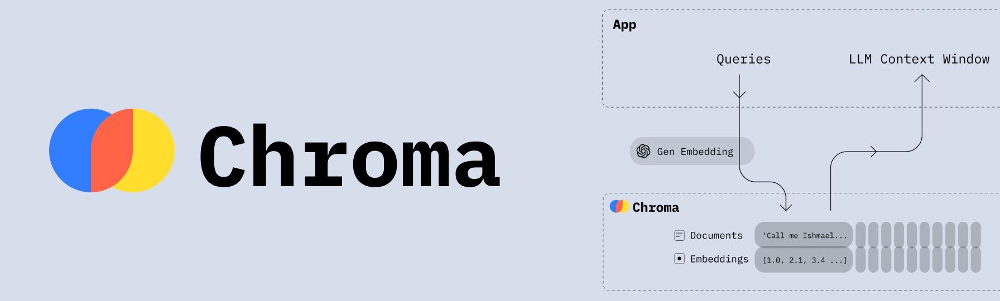

<p align="center"></p>

# ChromaDB PHP API Client

[](https://packagist.org/packages/helgesverre/chromadb)
[](https://packagist.org/packages/helgesverre/chromadb)

[ChromaDB](https://github.com/chroma-core/chroma) is an open-source vector database

## Installation

You can install the package via composer:

```bash
composer require helgesverre/chromadb
```

You can publish the config file with:

```bash
php artisan vendor:publish --tag="chromadb-config"
```

This is the contents of the published `config/chromadb.php` file:

```php
return [
    'token' => env('CHROMADB_TOKEN'),
    'host' => env('CHROMADB_HOST', 'localhost'),
    'port' => env('CHROMADB_PORT', '19530'),
];
```

## Usage

```php
// List all collections with optional pagination
$collections = $chromadb->collections()->list(limit: 10, offset: 0);

// Create a new collection with optional metadata
$createResponse = $chromadb->collections()->create('my_collection', metadata: ['type' => 'generic']);

// Count the number of collections
$count = $chromadb->collections()->count();

// Retrieve a specific collection by name
$collection = $chromadb->collections()->get('my_collection');

// Delete a collection by name
$deleteResponse = $chromadb->collections()->delete('my_collection');

// Update a collection's name and/or metadata
$updateResponse = $chromadb->collections()->update('collection_id', newName: 'new_collection_name', newMetadata: ['type' => 'updated']);

// Add items to a collection with optional embeddings, metadata, and documents
$addItemsResponse = $chromadb->items()->add('collection_id', ids: ['item1', 'item2'], embeddings: ['embedding1', 'embedding2'], metadatas: [['key' => 'value']], documents: ['doc1', 'doc2']);

// Update items in a collection with new embeddings, metadata, and documents
$updateItemsResponse = $chromadb->items()->update('collection_id', ['item1', 'item2'], embeddings: ['new_embedding1', 'new_embedding2'], metadatas: [['key' => 'new_value']], documents: ['new_doc1', 'new_doc2']);

// Upsert items in a collection (insert if not exist, update if exist)
$upsertItemsResponse = $chromadb->items()->upsert('collection_id', ['item1', 'item2'], embeddings: ['upsert_embedding1', 'upsert_embedding2'], metadatas: [['key' => 'upsert_value']], documents: ['upsert_doc1', 'upsert_doc2']);

// Retrieve specific items from a collection by their IDs
$items = $chromadb->items()->get('collection_id', ['item1', 'item2']);

// Delete specific items from a collection by their IDs
$deleteItemsResponse = $chromadb->items()->delete('collection_id', ids: ['item1', 'item2']);

// Count the number of items in a collection
$itemCount = $chromadb->items()->count('collection_id');

// Query items in a collection based on embeddings, texts, and other filters
$queryResponse = $chromadb->items()->query('collection_id', queryEmbeddings: ['query_embedding'], queryTexts: ['query_text'], include: ['embeddings', 'metadatas'], nResults: 10);
```

## Running ChromaDB in Docker

To quickly get started with Chromadb, you can run it in Docker

```bash
# Download the docker-compose.yml file
wget https://raw.githubusercontent.com/chroma-core/chroma/47447b6f9846fb63cc17d3f458df405387f46127/docker-compose.yml

# Start Milvus
docker compose up -d
```

A healthcheck endpoint will now be available on `http://localhost:9091/healthz`, and the Milvus API will be available
on `http://localhost:19530`.

To stop Chromadb, run `docker compose down`, to wipe all the data, run `docker compose down -v`.

Go to the ChromaDB [deployment documentation](https://docs.trychroma.com/deployment) for more information.

## Testing

```bash
cp .env.example .env

docker compose up -d
 
composer test
composer analyse src
```

## License

The MIT License (MIT). Please see [License File](LICENSE.md) for more information.
